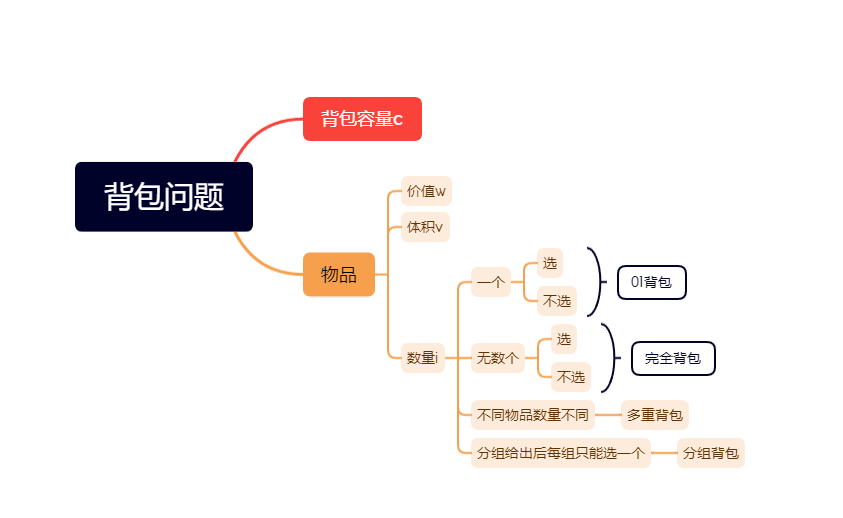

# AC1337

> 用于记录刷题的一些思路和技巧


## 算法可行性

| 数据规模 | 算法可接受时间复杂度 |
| -------- | -------------------- |
| <= 10    | O(n!)                |
| <= 20    | O(2^n)               |
| <= 100   | O(n^4)               |
| <= 500   | O(n^3)               |
| <= 2500  | O(n^2)               |
| <= 10^6  | O(nlogn)             |
| <= 10^7  | O(n)                 |
| <= 10^14 | O(sqrt(n))           |
| -        | O(logn)              |
| -        | O(1)                 |


## 线型处理逻辑

存储已知情况

### 栈

+ 单调栈，栈中元素为单调，[下一个最大的元素](https://leetcode-cn。com/problems/next-greater-element-i/)。
+ 成对出现的问题，用栈进行消消乐。

### 队列

+ 单调队列
+ 优先队列

## 树型处理逻辑

### 回溯

#### 组合问题

1. 无重复元素，可重复选择，组合出一个target; 

   - 下一层起点为i，这样保证只会从当前元素后开始往后选。
2. 有重复元素，不可重复选择，组合出一个target;
   1. 排序，使得相同元素连在一起。
   2. 跳过相同元素。
   3. 从i + 1开始进入下层搜索。
   

#### 排列问题

1. 无重复元素，所有排列情况;
   + 朴素版本(记录决策树):
     + 无需start，需要判断元素使用情况(visited数组/基于无重复直接在容器里面判断)。
   + 进阶版本(交换元素):
     + 考虑start后面的每个位置来填充start，知道start到达n;即通过交换i，start;
     + 下一层为start+1，即下一个要填的位置;
     + 这样[0，start]就是统计过的排列，[start+1，n-1]就是待统计的。
2. 有重复元素，排列情况。

#### 子集问题

> 组合没有顺序上的要求，只是选择上区别;排列是对顺序有要求。

1. 无重复元素，找所有子集。
   1. 回溯:记录决策树的每一个结点即可
   2. 状态压缩:已知所有可能性，用二进制表示，记录每一这可能性;即二进制每一位表示是否选择。
2. 有重复元素，找所有子集:
   1. 回溯:无重复情况+排序判断相邻元素去重。
   2. 状态压缩:无重复情况+排序判断相邻元素去重。即前一个元素相同但是没有被选择，那么选择当前情况必定重复。因为当前的情况之前肯定统计过了，考虑[1，2，2]的第二个2。。。
   3. 对重复元素排序处理:保证相同情况在同一层出现，出现一次就行了，后面都不再统计。
   4. 剪枝:有些时候需要贪心的先解决大的，大的搞不定小的肯定也不行。

### 递归玩法

+ 定义状态
+ 做出选择
+ 缩小范围
+ 上报结果

## 数组

1. 前缀和

2. 计数

3. 双指针

4. 二分法

   1. 找确定的目标值

   2. 猜数字

   3. 极大化极小，极小化极大。就是使得每部分的最大值最小。

      > 这种问题的一般结构就是，多种分配情况到达分组目标，每种情况中又会有最大值，判断所有情况中的最小的最大值。
      >
      > 具体题目模型参考: [分割数组的最大值](https://leetcode-cn。com/problems/split-array-largest-sum/)
      >
      > 也可以称之为: 根据答案二分。

   4. 旋转有序数组，旋转后分成两部分

      1. 两部分都是上升的
      2. 后部分小于前部分
      3. 利用和mid和left的值的对比，判断target处于哪个部分。

5. 滑动窗口

   ```java
   int i = 0;
   for (int j = 0; j < n; j++) {
       while (check()) {
           i++;
           //记录结果
       }
   }
   ```

   

6. 原地哈希

   > O(n)时间内使得数组有序，类似于计数排序，只不过把输入数组本身当成桶。

   1. 对于每个nums[i]，放入到对应下标位置。
   2. 再次遍历，没有归位的就是缺少的值。
   3. 一般有标记法和交换法
   4. 标记法
      1. 对归位后的数字进行标记，提前把负数改成N+1
      2. 把值对应的位置上的值加上负号，即nums[nums[i] - 1] = -abs(nums[nums[i] - 1])
      3. 没有标记为负数的就是没有归位的，即为缺失之数
   5. 交换法：
      1. 通过交换把值放到对应下标上，比如nums[0]放入nums[nums[0]]
      2. 再次遍历找出没有放入下标的值即可
   
7. 动态规划

   + 前缀和:

     > 前缀和其实也是一种动态规划，拥有最优子结构，用于范围求和。而且前缀和中元素一般都是递增的，可以用二分搜索。

   + 后缀和：有些情况需要求`i`左边的结果和`i`右边的结果，来简化计算，需要同时求前缀和与后缀和。

   + 背包问题

     + 0-1背包：物品只能用一次，取决于选与不选。

       一维空间:想明白遍历顺序，两个循环可否交换。

       ```java
       for(int i=0;i<cnt;i++){
           //由大到小，不可与外层交换。
         for(int j=cap;i>=0;j--){
               //求容量为j时，最大值。
               dp[j]=max(dp[j]，dp[j-w[i]]+v[i]);
           }
       }
       ```
     
     + 完全背包: 物品可以重复选择，每次选择一个
       一维空间:遍历顺序，循环可否交换位置。
     
       **如果求组合数就是外层for循环遍历物品，内层for遍历背包**。

       **如果求排列数就是外层for遍历背包，内层for循环遍历物品**。

       ```java
       for(int i=0;i<cnt;i++){
           //又小到大，可以交换循环位置。
           for(int j=0;j<=cap;j++){
               dp[j]=max(dp[j]，dp[j-w[i]]+v[i]);
           }
       }
       ```
     
     + 遍历顺序与排列组合的关系：外物内容是组合，外容内物是排列。

       **如果求组合数就是外层for循环遍历物品个数，内层for遍历背包容量**。

       **如果求排列数就是外层for遍历背包容量，内层for循环遍历物品个数**。

     + 多重背包:物品有次数限制

       ```java
       for(int i = 0; i < weight。length; i++) { // 遍历物品
           for(int j = bagWeight; j >= weight[i]; j--) { // 遍历背包容量
               // 以上为01背包，然后加一个遍历个数
               for (int k = 1; k <= nums[i] && (j - k * weight[i]) >= 0; k++) { // 遍历个数
                   dp[j] = Math。max(dp[j]， dp[j - k * weight[i]] + k * value[i]);
               }
               System。out。println(Arrays。toString(dp));
           }
       }
       ```
     
       **01背包一维化理解**

       > 一维化的本质:就是把二维的每一行依次用一行表示。用新一行的结果覆盖老的结果。
       > 由于二维情况可以，计算当前行需要上一行的值。
       > 如果只保留一行的话，那么新计算的结果就要重新写入数组。
       > 这时候不能覆盖上一行已经计算好的。
       > 从左往右的覆盖的话，那么计算下个j用的就是当前的i，而非i-1。
       > 从右往左的覆盖:用的还是上一行的数据。
     
     + 分组背包：每组只能选一个
     
     + 回文串问题

8. 差分数组：解决频繁**范围**修改，但是不用频繁查询的问题。

   1. [i， j]范围内全部+1，使用额外数组`dif[i]+1`，`dif[j+1]-1`。
   2. 用dif数组还原修改结果。

   > 不需要首项
   >
   > ```java
   > for(int i=1;i<diff。length;i++){
   > 	dif[i]+=dif[i-1];
   > }
   > ```
   >
   > 需要首项
   >
   > ```java
   > dif[0]=nums[0];
   > for(int i=1;i<diff。length;i++){
   > 	dif[i]=dif[i-1]+nums[i];
   > }
   > ```
   >

## 链表

1. dummy节点简化代码。
2. 快慢指针：
   1. 环形链表
   2. 两链表相交
   3. 删除重复值
3. 翻转链表：转化为基础的翻转链表。

## 树

> 这里指的是单纯的内存意义上的物理树，和逻辑树不同。

1. DFS(先序，中序，后序，mirrors)，BFS

2. 二叉搜索树的中序遍历是升序

3. 数的直径

4. [公共祖先问题](https://leetcode-cn。com/problems/er-cha-shu-de-zui-jin-gong-gong-zu-xian-lcof/)

5. 树的生成

   > + 插入操作基于代码模式 root。next=f(root。next，。。。)
   > + 一般分治而成，即找到根节点后把区间缩小，逐步生成

​	5。 树上dp

## 图

1. 物理结构 ：邻接表、临界矩阵、边的数组、父结点数组、链式向前星。
2. 求联通分量，并查集、dfs、tarjan、Kosaraju
3. 找环：
   1. dfs
   2. bfs
4. 拓扑排序：依赖顺序问题
   1. 必须是有向无环图(DAG)
   2. DFS的逆后序，即把dfs的后序结果用栈保存起来。
   3. BFS:把入度为0的先放入，然后遍历到一个结点就减少这个结点的入度。
5. 最小生成树：
   1. Prim：点按照已经生成的森林最近的距离加入树
   2. Kruskal：边按照权重排序加入生成树
6. 最短路：
   1. 无权最短路：bfs
   2. 非负权重最短路：Dijstra，理解松弛操作，就是bfs加了优先队列。
   3. 负权重：Bellman-Ford，复杂度O(VE)
7. 欧拉回路
8. 基环内向树：图中有环，环上有些节点会有分支，形成有一个有环的树。常见解法：
   1. 用拓扑排序找出环
   2. 判断节点是在链表上，还是在环上

9. 二分图判定
10. DFS 时间戳，即Tarjan相关算法。

## 字符串

+ 排序问题
  + 计数排序 分组问题，通过组号分发到数组。
  + 基数排序 
    + LSD 定长字符串，从右往左排序。
    + MSD 随机字符串，从左往右排序。
  + 三向快排 处理有大量重复键的排序问题
  + 常规比较排序
+ 查询问题
  + Trie(字典树，前缀树)
  + Map
+ 子串查找
  + 暴力法
  + 滑动窗口
  + KMP 了解DFA
  + BM
  + RK
+ 正则表达式 了解NFA
+ 数据压缩 (数据都可以转成二进制，二进制流都可以理解为字符串)
  + 双位压缩 对于DNA的4种碱基ACTG，可以用11 00 01 10 四种方式表达，但是只用两位。
  + 游程编码(Run-Length Encoding) 首先转为二进制，将连续相同部分进行编码，如`0000000000000001111111000000011111111111`记成15个0，7个1，7个0，11个1，由于01交换出现，所以只对长度就行，把15 7 7 1改成二进制1111 0111 0111 1011，完成压缩。
  + 霍夫曼(Huffman) 通过字符出现频率压缩
  + LZW

## 位运算

+ a | b：计算并集

+ a & b： 求a和b的最长公共前缀后面补齐0。如1010与1000得到1000

+ a ^ b：不进位相加

+ 汉明距离：x^(x-1) 最低位的1变成0。 如110 ^ (100 - 1)结果为100

+ lowbit: x & (-x) 截断x最低位的1及其后缀，必定是2的n次幂。 如1100 & (-1100）时结果为100

+ 求子集: 求k的二进制子集，针对中的二进制为1的位开始进行减法，判断数字k的二进制子集， 像枚举(2^k-1) ~ 0一样枚举其子集

  ```java
  int sub = k;
  do {
      //sub就是一个子集
      sub = (sub - 1) & k;
  } while(sub != k);
  ```


+ 去掉最后一位 | (101101->10110) | x >>1
+ 在最后加一个0 | (101101->1011010) | x <<1 
+ 在最后加一个1 | (101101->1011011) | x << 1+1 
+ 把最后一位变成1 | (101100->101101) | x or 1 
+ 把最后一位变成0 | (101101->101100) | x or 1-1 
+ 最后一位取反 | (101101->101100) | x xor 1 
+ 把右数第k位变成1 | (101001->101101，k=3) | x or (1 << (k-1)) 
+ 把右数第k位变成0 | (101101->101001，k=3) | x and not(1 << (k-1)) 
+ 右数第k位取反 | (101001->101101，k=3) | x xor (1 << (k-1)) 
+ 取末三位 | (1101101->101) | x and 7 
+ 取末k位 | (1101101->1101，k=5) | x and (1 << k-1) 
+ 取右数第k位 | (1101101->1，k=4) | x >> (k-1) and 1 
+ 把末k位变成1 | (101001->101111，k=4) | x or (1 << k-1) 
+ 末k位取反 | (101001->100110，k=4) | x xor (1 << k-1) 
+ 把右边连续的1变成0 | (100101111->100100000) | x and (x+1) 
+ 把右起第一个0变成1 | (100101111->100111111) | x or (x+1) 
+ 把右边连续的0变成1 | (11011000->11011111) | x or (x-1) 
+ 取右边连续的1 | (100101111->1111) | (x xor (x+1)) >> 1

## 数学

### 数论

#### MOD运算

+ 同余定理:a MOD M==b MOD M  等价于 (a-b) MOD == 0

+ a + b会溢出: (a + b) mod M = (a mod M + b mod M) mod M

+ 防止出现负数 +M:(a - b) % M = (a % M - b % M + M) % M

+ (ab)%M = (a%M)(b%M)%M

+ 对于MOD除法 这里要求b和M互质，且M是质数。

  + 不能这么玩（a/b) % M != ((a%M) / (b%M)) % M

  + 正确玩法 求逆元+费马小定理 

    > 求（a/b) % M问题转化为 求b的逆元，即a*b^(-1)%M，此时只需求b^(-1)的值
    >
    > b* b^(-1)与1模M同余
    >
    > 费马小定理得：M为质数时，b^(M - 1) 与1模M同余
    >
    > 可得b* b^(M - 2)与1模M同余
    >
    > 取b的逆元为b^(M-2)
    >
    > 最终（a/b) % M == a * pow(b，M - 2) % M，pow为求幂，可用快速幂实现。

    

#### 最大公因数与最小公倍数

+ gcd(a，b) == gcd(b，a)

+ gcd(a，b) == gcd(a-b， b) (a > b)

+ gcd(a，b) == gcd(a%b， b)

+ gcd(a，b，c) == gcd(gcd(a，b)，c)

+ gcd(ka，kb) ==  kgcd(a，b)

+ 最小公倍数模板

  ```java
  //lcm(a，b) = (a * b) / gcd(a，b)
  //先乘后除防溢出
  public long lcm(long a， long b) {
      return a / gcd(a， b) * b;
  }
  ```

#### 组合数取余

> 从n中取m个元素，记为C(n， m) = n! / (m! * (n - m)!)，又知C(n， m) = C(n - 1， m - 1) + C(n - 1， m);

+ 求C(n， m) % M

  + O(n^2)

    ```java
    int M = (int)1e9+7;
    long C[1005][1005];
    void getC(int n){
        for(int i=0;i<=n;i++){
            for(int j=0;j<=i;j++){
                if(j==0 || j==i)
                    C[i][j]=1;
                else
                    C[i][j]=(C[i-1][j-1]+C[i-1][j]) % M;
            }
        }
    }
    ```

  + O(n)

    ```java
    //逆元方法
    int mo = (int)1e9 + 7;
    long C(long n，long m){
        long M=0，inv[N]，mul[N]，invMul[N];
        while(M<=n){
            if(M){
                inv[M]=M==1?1:(mo-mo/M)*inv[mo%M]%mo;
                mul[M]=mul[M-1]*M%mo;
                invMul[M]=invMul[M-1]*inv[M]%mo;
            }
            else mul[M]=1，invMul[M]=1;
            M++;
        }
        return mul[n]*invMul[m]%mo*invMul[n-m]%mo;
    }
    ```

  + 如果对质数求余，可用Lucas定理在O(n)复杂度解决

    ```java
    long Lucas(long n，long m，long p){
    	long ans=1;
        while(n|m)ans=ans*C(n%P，m%P)%P，n/=P，m/=P;
        return ans;
    }
    ```

    

### 概率与统计

> 这类问题离不开随机函数

**rand7生成rand10**

+ 蒙特卡洛方法之拒绝采样
+ (randX() - 1)*Y + randY()可以等概率的生成[1， X * Y]范围的随机数
+ 大范围randx生成小范围randy:可用randx%y+1
+ x必须是y的倍数才能等概率的生成，所以如果不是倍数，那么对于生成的不符合的值要去掉。即一直循环到合适的。

**水塘抽样**

+ 详见[相同概率取元素](https://leetcode。cn/problems/linked-list-random-node/submissions/357625015/)

  


## 数据结构设计

+ 栈生成队列
+ 队列生成栈
+ LFU
+ LRU

## 经典算法

+ 线性筛：用于线性速度搜索n以内的质数
+ 扫描线：矩阵相交求面积、周长、点的个数问题。
+ 倍增：快速幂、最近公共祖先
+ 摩尔投票法：消消乐。
+ 计算根号2：牛顿迭代法
+ TopK问题
  + 堆(优先队列) O(nlogk)
  + 快速选择 O(n)
  + 二叉搜索树O(nlogk)
  + 排序
+ 多路归并问题
+ 快速选择
+ 逆序对
